## Electric Charge 
- Carried by certain subatomic particles

    
    - electrons are the **essence of electricity** and **easily transferrable**
- Each electron carries a fundamental charge
    - $1.6 \times 10^{-19}$C
    - this value is negative for electron, positive for proton
- Opposite charges attract, Like charges repel.
    - Why opposite charges attract each other?
        - [[Coulomb's Law | a.phy.coulomb's-law.md]]
        - shows that the electric force increases when charge increases and decreases when distance increases

- Categorize substances by their ability to transfer electric charge
    - easily transfer -> **Conductor**
        - most of them are metals, allow the electrons to flow freely through the metalic bonds
    - can't -> **Insulator**

## Electric Field

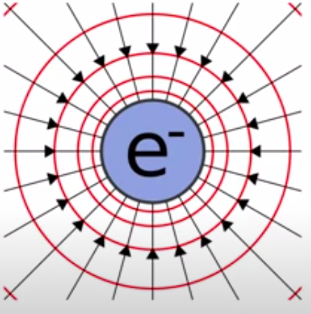

- Any charged object forms an electric field around itself
    - Another charge object enters, **interaction** will occur
  
### Drawing electric field lines

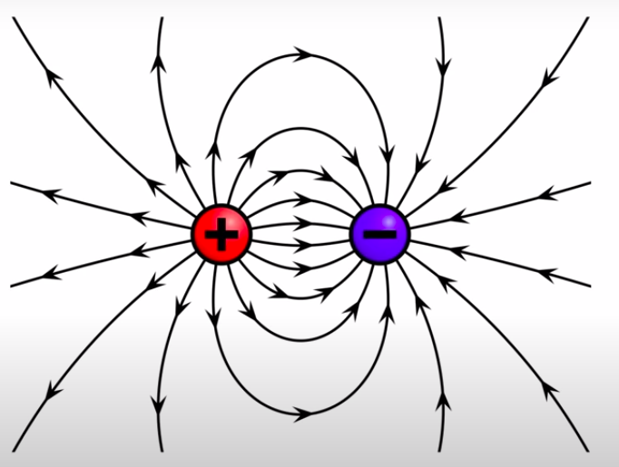

    
- don't really exist but is a convinient way to analyze the direction of a field in any point in space

## Electric potential
- Similar to gravitational potential energy, an object can:
    - have **electrical potential energy**
    

    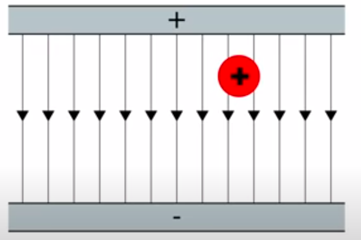
    

    - charges can **flow and generate current**

### Force, Energy, Potential, Field with analogy to Gravity
From [this video](https://www.youtube.com/watch?v=xrQCPYsoBKk).

| Comparison      | Gravity                                     | Electric                                    |
|-----------------|---------------------------------------------|---------------------------------------------|
| Field (Uniform) | 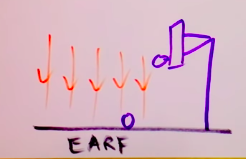 | 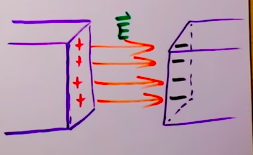 |
| Force             |   $F = mg$                                          |   $F = +/-qE$                                           |
| Energy         |   $E_g = mgh$                                          |   $E = qEd$       (d = distance moved against the field)                                   |
| Potential | $gh$ | $V = Ed$ (d = distance move against the field) |
|Field| $g$  | $E$ |

- move with the field
    - $E = qE(-d)$ (d = distance move with the field)
    - potential decreases, hence $Potential = E(-d)$ (d = distance move with the field)

## Physical Quantities Explained

### Electric Charge 电荷
Measured in Coulomb (C)
- How many electrons are there in 1 Coulomb?
    $$Q = n \times e$$
    Q = charge in coulombs
    n = number of electrons
    e = elementary charge (aka charge of electrons and protons, constant) = $1.6 \times 10^{-19}C$ 
$$n = \frac{Q}{e}$$
$$n = \frac{1C}{1.6 \times 10^{-19}C}$$
$$n = 6.2 \times 10^{18} \ electrons$$

In 1 coulomb of charge you have $6.2 \times 10^{18}$ electrons.

### Voltage 电压
measured in volts (V)
- 电压是推动电子流过导线的能量
- the electric potential difference "pushes" the electrons through the resistors
$$V = \frac{Energy}{Charge} = \frac{J}{C}$$
- As a 1 C charge moves through a potential difference of 1 V it gains 1 J of energy
- 1伏特等於對每1庫侖的電荷做了1焦耳的功 
- Volts measure **change in energy per unit charge**

Voltage is the electric potential difference, it is like a hill that lets electrons silde down. So the "steeper" the "hill" is, the faster the electrons will move. 

#### Measurement
Voltmeter
- connected in parallel
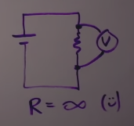
- an ideal voltmeter should have infinite resistance so no current will pass through it, hence not effecting the current

### Current 电流
measured in ampere (A)
- charge flow produce usable energy
- movement of the charge (aka conventional current, **from +ve to -ve**) is always opposite to the movement of the electrons (**from -ve to +ve**)
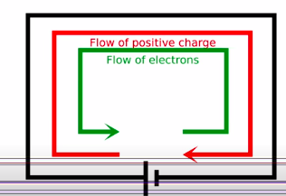
- current exists when electric charge travels through a medium
$$I = \frac{Charge}{Time} = \frac{C}{s}$$
- **how much coulomb of charge passed a point in the circuit every second**
- **Only dependent on Voltage and Resistance**
#### Measurement
Ammeter
- connected in series
    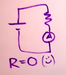
- an ideal ammeter should have no resistance so it will not effect the current

### Resistance 电阻
measured in Ohm (Ω)
- the **ability of a material to oppose charge flow**
$$R = \frac{{Electrical \ Potential \ difference}}{Current} = \frac{V}{A}$$

### Electric Power
measured in Watts (W)
- Rate at which electrical energy is converted to other forms
$$P = IV = \frac{J}{s}$$

### Summary
| Physical Quantities               | Symbol | SI Unit |
|-----------------------------------|--------|---------|
| Electric Charge 电荷              | Q      | C       |
| Current 电流                      | I      | A = C/s      |
| Voltage/Potential Difference 电压 | V      | V = J/C      |
| Resistance 电阻                   | R      | Ω = V/A       |
| Electric Power                   |  $P_E$| W = J/s|
---

## Ohm's Law
Ohm's Law states that: $I \ \alpha \ V$ (Current is directly proportional to voltage)

dp: directly proportional
ip: inversely proportional

$V=IR$ **(V dp I)** ; P=VI -> V = P/I  **(V ip I)**
Why would this happen?

- [[Ohm's Law | a.phy.current-electricity.ohm's-law.md]] 
    - 对于同一个电阻，电压与电流成正比
    - Provide 越多电流 -> 量到越多电流（成倍数）**（R 不变）**
    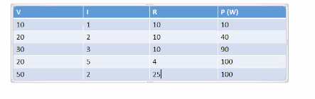
只有R和其他因素（如温度）不变，才能知道两者（V and I）是否成正比

## Circuits
### Two requirements to form a circuit
1. Closed conducting path that extends from the positive terminal to the negative terminal
2. There must be an electric potential difference across the two ends of the circuit (for the cell)

### Basic Components of a circuit
1. controller (switch, ~~Nintendo Switch~~) 开关
2. energy source (cell) 电池
3. conductor（wire）导线
4. electrical load (device) 用电器

### Types of Circuits
- open circuit 开路/断路 - disconnected 无通电
    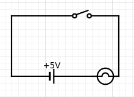

- closed circuit 通路 - connected 通电
    - series circuit 串联电路
    - parallel circuit 并联电路
- short circuit 短路
    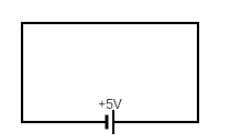

    - generate an excess of voltage streaming and cause excessive flow of current in the power source
    - causing the power source to be destroyed

### Series and Parallel Circuits
| Comparison |                       Series                      |                        Parallel                       |
|:----------:|:-------------------------------------------------:|:-----------------------------------------------------:|
| Example    | 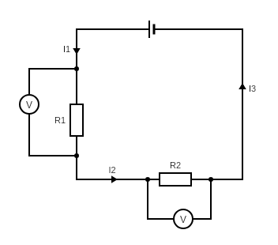       | 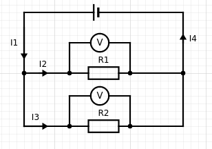           |
| Current    | Same everywhere in the current : $I_1 = I_2 = I_3$ | $I_1 = I_2+I_3 = I_4$                                 |
| Voltage    | $V = V_1 + V_2$                                 | $V = V_1 = V_2$                                    |
| Resistance | $R_{eff} = R_1 + R_2$                           | $\frac{1}{R_{eff}} = \frac{1}{R_1} + \frac{1}{R_2}$ |

---

In parallel circuits, 
$I_1 = I_2 + I_3$

According to Ohm's Law, 

$\frac{V}{R_{eff}} =  \frac{V_1}{R_1} + \frac{V_2}{R_2}$

Since 
$V = V_1 = V_2$, 

$\frac{1}{R_{eff}} = \frac{1}{R_1} + \frac{1}{R_2}$

$R_{eff}$: Equivalent Resistance = Effective Resistance = Total Resistance 有效电阻/等价电阻

---
Why will the current increase if we add resistors in parallel circuits?
- Ideally, wires have no resistance. So the resistors can be seen as directly connected to the battery, thus having the same voltage with the battery

How about series circuits? Why don't series circuits work in the same way?
- In series circuits, the resistors are between each other, so we can't imagine them **directly connected** to the battery, hence the voltage gets "distributed" among the resistors

---

((ref:[[a.phy.current-electricity.2020-09-10]]))

---

((ref:[[a.phy.current-electricity.2020-09-08]]))
