[[Date | meta.date]]: [[journal.2020.09.10]]
Time: 1:30pm to 2:30pm
# 2020年初三升高一说明会
家长函 - 家长线上讲座
    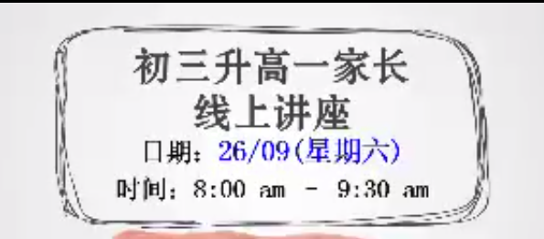
初三毕业标准
    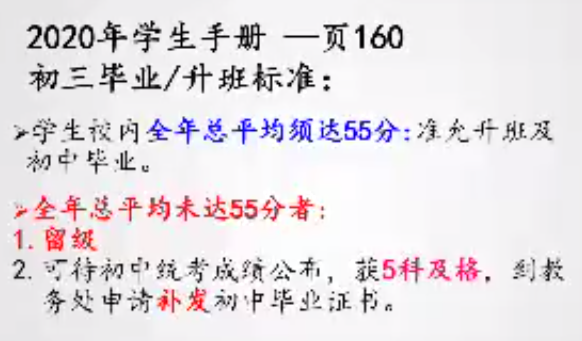
高中分科，共同科
    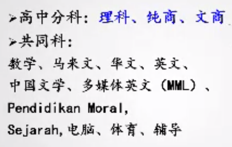
    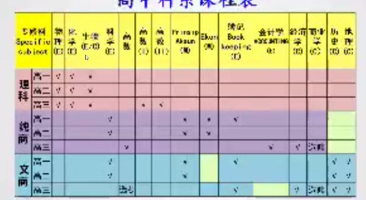

## 理科 Science
### 理科标准
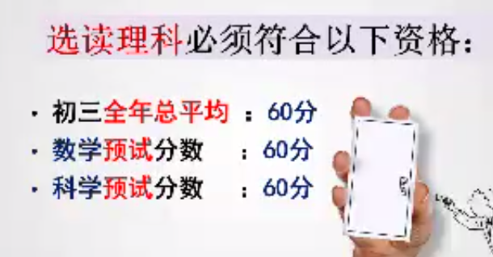
### 生物
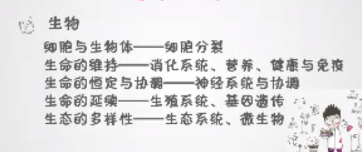
### 物理
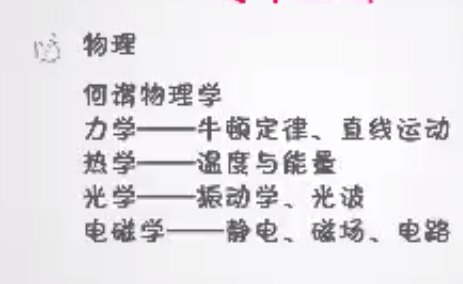
### 化学
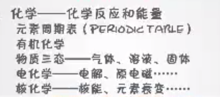

### 范畴

---

## 商科 
谢俊瀚老师
### 簿记 Book Keeping

### 经济学 Economics

### 范畴

---

## 文商
### 历史
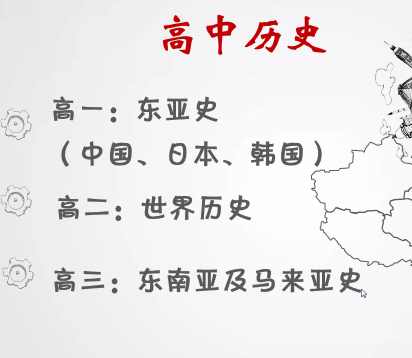

### 地理

---

## 文理科界限淡化
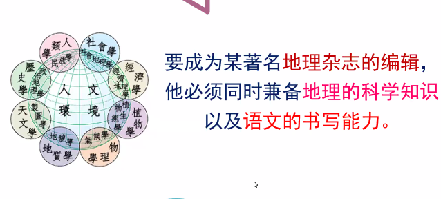

## 参考

- 填写2020年初三升高一选科系意愿表
  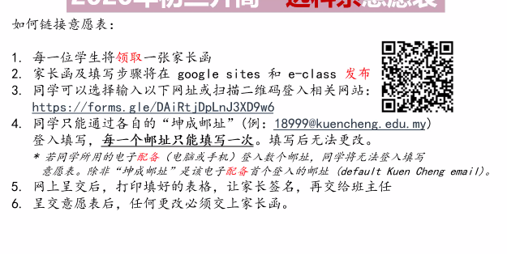
  